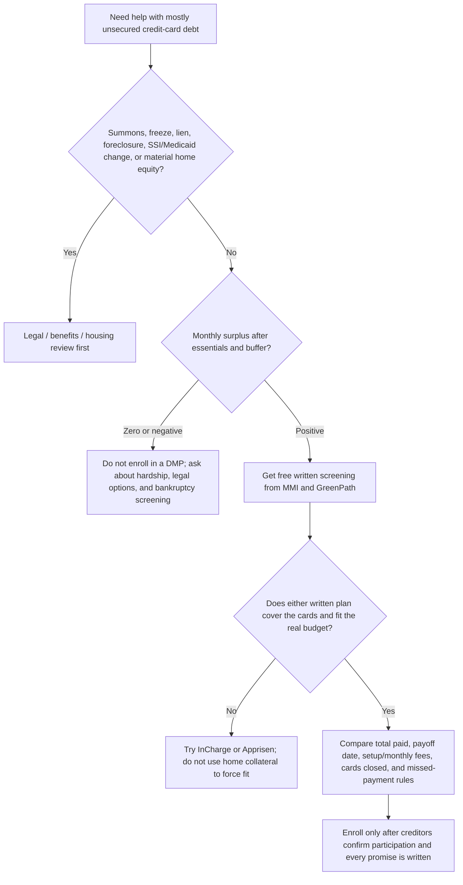

# Compare nonprofit debt-management counselors

**Reviewed August 17, 2026.** This page compares nonprofit credit-counseling and debt-management-plan (DMP) providers—not debt-settlement companies or consolidation-loan lenders. A DMP usually repays the full eligible balance through one payment, often with reduced interest/fees; it is not a new loan and is not a promise that debt will be forgiven. [CFPB: counseling versus settlement/consolidation](https://www.consumerfinance.gov/ask-cfpb/what-is-the-difference-between-credit-counseling-and-debt-settlement-debt-consolidation-or-credit-repair-en-1449/).

> **No universal winner.** For a Maryland homeowner with SSI/SSDI, possible home equity, or a lawsuit/judgment, first get legal and benefits screening. A DMP is appropriate only if the proposed payment still leaves a real essentials-first buffer. Do not convert cards into a home-secured loan just to make a payment fit.

## The practical recommendation

**Start with free, no-obligation reviews from Money Management International (MMI) and GreenPath. Do not enroll during either first call.** Ask both to send the exact Maryland quote, eligible-creditor list, proposed payment, payoff month, every fee, and effect on each card in writing. Pick the one whose written plan is genuinely affordable and covers the relevant cards—not the one with the boldest savings claim.

If either plan needs money that the survival budget does not have, or a summons, lien, bank freeze, SSI/Medicaid issue, or material home equity is involved, **do not choose a DMP yet**. Use [urgent help](./urgent-help/), [benefits guidance](./benefits/), and a Maryland consumer/bankruptcy consultation.

**Already sued or holding court papers?** Read [the lawsuit, DMP, and legal-decision guide](./sued-and-debt-programs/) before making a counseling appointment. A DMP does not answer the case for you.

**Want to check historical legal matters?** See [legal history of MMI and GreenPath](./provider-legal-history/). It separates allegations, settlements, regulator orders, and procedural rulings rather than treating a lawsuit title as proof of current misconduct.

**Protect privacy without hiding material facts:** use the [first-call privacy and accuracy FAQ](./faq/#first-call-with-mmi-or-greenpath-what-should-i-not-reveal) before contacting either provider.

**Ready to call?** Use the [Maryland nonprofit DMP first-call playbook](./first-call-dmp-playbook/) to get comparable written terms from MMI and GreenPath without authorizing enrollment on the call.

**Before signing anything:** use the [Maryland DMP acceptance guide](./maryland-dmp-acceptance-guide/) to check licensing, statutory fee limits, required agreement terms, and creditor acceptance.

## Transparent shortlist — ranked for a Maryland DMP screening

This is a **screening rank**, not an endorsement or prediction of outcomes. Rank uses: Maryland/DOJ listing where available, NFCC membership, nonprofit/counseling scope, fee transparency, housing/other counseling scope, and an A+ BBB rating checked on the linked profile. BBB is only one consumer-information signal; it is not a quality certification and local BBB profiles can differ in accreditation status.

| Rank | Organization | Why it is on the shortlist | Fees disclosed by organization | BBB snapshot — check again before choosing | Best use |
|---:|---|---|---|---|---|
| 1 | [Money Management International (MMI)](https://www.moneymanagement.org/debt-management) | NFCC member; COA-accredited and HUD-certified according to MMI; appears on the [U.S. Trustee’s Maryland credit-counseling list](https://www.justice.gov/ust/credit-counseling-by-state/Maryland); MMI discloses Maryland licensing. | MMI says its DMP clients average a $37 setup fee ($75 maximum) and $26/month ($69 maximum); ask for the Maryland-specific figure and any waiver. | [Maryland-area BBB profile: A+](https://www.bbb.org/us/md/silver-spring/profile/credit-and-debt-counseling/money-management-international-inc-1126-8202/addressId/434603). Accreditation labels vary across BBB location profiles. | **First call** when a broad counseling/housing/debt screen and a written DMP quote are needed. |
| 2 | [GreenPath Financial Wellness](https://www.greenpath.com/counseling/debt-counseling/) | National nonprofit; NFCC- and HUD-certified counselors; NFCC member; appears on the [U.S. Trustee’s Maryland list](https://www.justice.gov/ust/credit-counseling-by-state/Maryland). | GreenPath states average DMP fees of $35 enrollment + $31/month; exact fees vary by state and debt. | [BBB profile: A+ and accredited](https://www.bbb.org/us/pa/philadelphia/profile/credit-and-debt-counseling/greenpath-financial-wellness-0241-236059087). | **Second call / strong comparator** for an independent written quote and credit-card DMP fit. |
| 3 | [InCharge Debt Solutions](https://www.incharge.org/debt-relief/credit-counseling/maryland/) | Nonprofit, NFCC member, and listed by the U.S. Trustee for Maryland; its Maryland page describes free counseling and DMP availability. | InCharge reports an average $52 setup fee and $34/month; exact state fees vary. | [BBB profile: A+ and accredited](https://www.bbb.org/us/fl/orlando/profile/credit-and-debt-counseling/incharge-debt-solutions-0733-24000449). | **Third quote** if the first two do not cover a creditor, quote an unaffordable plan, or have an access issue. |
| 4 | [Apprisen](https://www.apprisen.com/about/) | NFCC member and national nonprofit; says it serves all 50 states and offers a free financial review. | Apprisen says fees will not exceed $45 setup + $45/month and may be reduced/eliminated for hardship. Confirm Maryland availability and all current terms. | [BBB profile: A+ and accredited](https://www.bbb.org/us/oh/gahanna/profile/credit-and-debt-counseling/apprisen-0302-972). BBB location profiles can vary. | **Backup comparator** where the first three are not a fit. |

### Why not rank debt-settlement firms or consolidation-loan ads here?

They are different products with different risks. CFPB warns that settlement companies commonly charge significant fees and may tell people to stop paying while funds accumulate, increasing interest, fees, collection pressure, credit damage, and lawsuit risk. A consolidation loan can also be unaffordable—or dangerous if it is secured by a home. [CFPB: debt-relief risks](https://www.consumerfinance.gov/ask-cfpb/what-is-a-debt-relief-program-and-how-do-i-know-if-i-should-use-one-en-1457/); [scam and settlement guide](./scams/).

## Which one should I pick? Decision tree

## Comparison worksheet — do not sign on the call

| Question | MMI | GreenPath | InCharge | Apprisen |
|---|---:|---:|---:|---:|
| Initial counseling free? |  |  |  |  |
| Every included creditor/account listed? |  |  |  |  |
| New single payment | $ | $ | $ | $ |
| Setup fee | $ | $ | $ | $ |
| Monthly fee | $ | $ | $ | $ |
| Total estimated program fees | $ | $ | $ | $ |
| Payoff month / number of payments |  |  |  |  |
| Interest rate or concession on each account |  |  |  |  |
| Which cards must close? Can one emergency card remain? |  |  |  |  |
| What happens after one missed payment? |  |  |  |  |
| Creditor acceptance confirmed in writing? |  |  |  |  |
| Fee waiver/reduction available? |  |  |  |  |

**Walk away** if the counselor will not provide free service information, pushes enrollment before reviewing the full budget, will not quote all fees in writing, is paid more when you enroll, promises to erase debt, tells you to stop communicating with creditors, or guarantees a result. CFPB says to confirm with creditors that they accepted a proposed DMP before sending payments to the counseling organization. [CFPB: how to choose a counselor](https://www.consumerfinance.gov/ask-cfpb/what-is-credit-counseling-en-1451/).

## BBB: useful, but not a scorecard

BBB’s letter grade reflects BBB’s view of business interactions; it does not establish that a plan fits your budget, that every creditor will participate, or that a provider is the right choice. Use it to check a current profile, complaints, responses, business identity, and service area—then give more weight to the written plan, regulator/association checks, and the exact affordability calculation. BBB profiles and accreditation can differ by location, so open the linked profile and verify the legal entity before signing.

## Independent places to verify a provider

- [NFCC member-agency list](https://www.nfcc.org/nfcc-member-agencies/)
- [U.S. Trustee credit-counseling agencies for Maryland](https://www.justice.gov/ust/credit-counseling-by-state/Maryland) — relevant to approved pre-bankruptcy counseling; it is not a complete quality ranking.
- [Maryland Office of Financial Regulation](https://labor.maryland.gov/finance/consumers.shtml) — ask about licensing/complaint checks.
- Your card issuers — call hardship departments directly and compare their written options against any DMP.

Next: [resolution paths and bankruptcy](./options/) →
