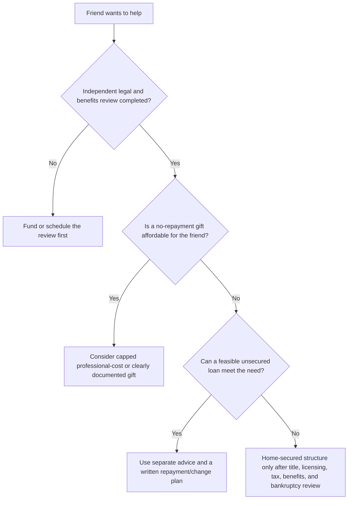

# Help from friends without pressure

The best first ask is often: **“Will you help me pay for independent advice so I do not accidentally put my home, benefits, or friendship at risk?”**

The communication principle is simple: make the request exact and limited; give a real, consequence-free “no”; disclose risk; let each person obtain separate advice; and never create artificial urgency.

## A one-page request

> **Purpose:** I am obtaining professional advice about approximately $40,000 of credit-card debt. I am protecting housing, disability benefits, and our friendship. No decision is required today.
>
> **Facts:** dependable monthly income $___; essential monthly costs $___; sustainable debt-payment ceiling $___; home value $___; mortgages/liens $___ or “being verified”; benefits ___ (SSDI/SSI/both/unknown).
>
> **Limited request:** Would you consider [reviewing this information / a capped contribution to legal or benefits advice / a gift only]? A loan secured by my home is not being requested unless independent advice is obtained on both sides.
>
> **No pressure:** “No” is completely okay and will not affect our relationship. Please take time and reply privately if you prefer.

## Help menu

| Structure | What it changes | Minimum protection |
|---|---|---|
| Outright gift | No repayment or foreclosure obligation. | Check SSI/Medicaid reporting/timing and donor gift-tax reporting. |
| Smaller gifts from several people | Spreads cost, but does not change benefits rules. | Each gift is voluntary and separately documented. |
| Restricted professional-cost gift | Funds a better decision rather than a debt payoff. | Cap the amount/purpose; consider direct provider payment after benefits guidance. |
| Conditional/matching gift | Can reward follow-through. | Conditions must be objective, humane, and non-controlling. |
| Attorney escrow settlement fund | May keep settlement money controlled and documented. | Attorney confirms ethics, tax, benefits, and bankruptcy effects first. |
| Unsecured promissory note | Creates a lender/borrower relationship without house collateral. | Clear written terms, feasible schedule, interest/tax terms, change/default process. |
| Note plus recorded deed of trust | Gives friend real-estate security. | Separate Maryland lawyers, title review, closing, recording, licensing analysis, and an explicit foreclosure/exit plan. |
| Interest-only or balloon loan | Low initial payment but leaves a large later obligation. | Identify a realistic balloon source; define sale/death/move and heirs’ rights. |
| Shared equity / property interest | Raises cash but gives up control and future value. | Appraisal, independent counsel, co-owner/exit/death provisions, SSI transfer review. |
| Friend guarantee | May unlock bank credit but exposes friend to collection. | Guarantor gets separate legal/financial advice. |

## Can a friend make a private loan secured by the house?

Potentially, yes. A genuine private loan can use a note and Maryland deed of trust/mortgage. It is not a DIY form exercise. A recorded residential instrument has title, priority, affidavit, closing/recording cost, foreclosure, and potentially mortgage-lender/originator licensing issues. Maryland law requires licensing information or an exemption affidavit in a recorded residential mortgage instrument. [Md. Real Prop. § 3-104.1](https://mgaleg.maryland.gov/mgawebsite/Laws/StatuteText?article=grp&enactments=false&section=3-104.1).

The friend’s lien normally sits behind existing earlier liens and can be eliminated by a senior foreclosure; a default under the friend’s own lien can put the house at risk. [Maryland foreclosure statute](https://mgaleg.maryland.gov/mgawebsite/laws/StatuteText?article=grp&section=7-105).

This structure only improves the position when the full budget supports it, the cards are actually resolved, all-in cost is lower, better house-preserving options are unavailable, and benefits/bankruptcy advice does not identify a worse consequence. It can worsen the position by replacing potentially dischargeable unsecured debt with foreclosure-capable debt.

## Payment reality check

Illustration: $40,000, fixed 8% annual interest, monthly amortization, no fees.

| Term | Approx. monthly payment | Approx. total paid |
|---|---:|---:|
| 5 years | $811.06 | $48,663 |
| 10 years | $485.31 | $58,237 |
| 15 years | $382.26 | $68,807 |
| Interest-only | $266.67/month | $40,000 balloon remains |

In July 2026, IRS AFRs were 4.00% short-term, 4.35% mid-term, and 4.98% long-term annually; confirm the applicable month and loan term with a tax professional. [IRS Rev. Rul. 2026-12](https://www.irs.gov/irb/2026-28_irb). For 2026, the federal annual gift-tax exclusion is $19,000 per donor per recipient; over that amount often creates a reporting issue, not automatically current tax due. [IRS FAQ](https://www.irs.gov/businesses/small-businesses-self-employed/frequently-asked-questions-on-gift-taxes).

Next: [free and low-cost help](./resources/) →
