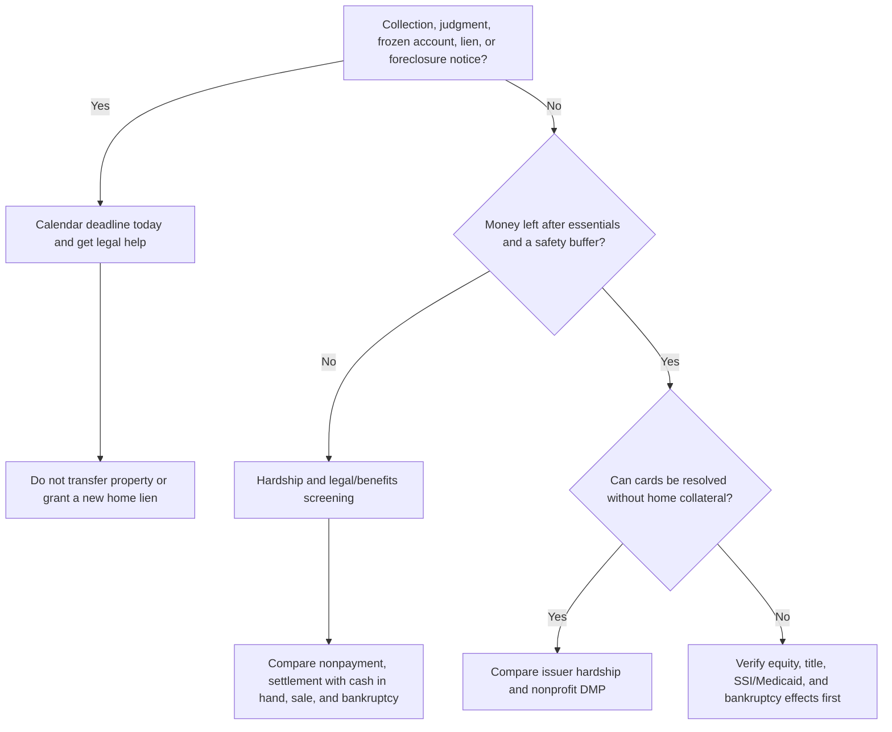

# Maryland debt decision wiki

**For a Maryland homeowner with disability income and about $40,000 in credit-card debt.** Research current through August 16, 2026.

> This site is general educational information, not individualized legal, tax, benefits, or financial advice. Do not sign a deed, deed of trust, loan, settlement, or bankruptcy filing based only on this site.

## Start here

The first task is **not** to find $40,000. It is to protect housing, food, medical care, utilities, benefit eligibility, and friendships while finding out what is actually at risk.

1. **[Court papers, frozen account, lien, or foreclosure notice? Start here now.](./urgent-help/)** Preserve the deadline, papers, and benefit records; get the right help today.
2. [Stabilize and collect the facts](./getting-started/). Keep essentials current, open all mail, and calendar every court deadline.
3. [Protect disability income and benefits](./benefits/). SSDI and SSI have importantly different rules.
4. [Understand collection and home risk](./creditors/). A house can matter even when income is protected.
5. [Compare non-bankruptcy and bankruptcy paths](./options/). Do not force a repayment plan that the essentials-first budget cannot support.
6. [Compare nonprofit debt-management counselors](./compare-credit-counselors/). Use written quotes and an affordability test—not advertising or star ratings.
7. [If you are sued: debt programs, court steps, and questions](./sued-and-debt-programs/). Keep a DMP decision separate from the court deadline.
8. [Check DMP provider legal history](./provider-legal-history/). Read outcomes accurately: an allegation, settlement, and final judgment mean different things.
9. [Screen debt-relief marketing and scams](./scams/). “Debt consolidation” ads may actually sell debt settlement, with very different risks.
10. [Approach friends without pressure](./friends/). A home-secured loan should be a late-stage, independently reviewed choice—not the starting point.
11. [Use verified starting resources](./resources/) or [Jewish community support and referrals](./jewish-community/). Free screening and brief advice can clarify the important branches.
12. [Read practical FAQs](./faq/), [look up key terms](./key-terms/), and see the [research and review trail](./research-governance/) before making a decision.

## The central risk tradeoff

Ordinary credit-card debt is generally unsecured and may be dischargeable in bankruptcy. A friend loan secured by the home can convert that debt into foreclosure-capable debt if payments fail. It can make sense only after a real budget, title/equity, benefits, tax, and bankruptcy review.

Social Security benefits have strong federal protection from ordinary private creditors, but a person with a valuable house is not automatically “judgment proof.” See [42 U.S.C. § 407](https://www.law.cornell.edu/uscode/text/42/407) and the [Maryland Courts collection guide](https://www.mdcourts.gov/courthelp/judgmentsanddebtcollection).

## Quick decision tree

## What this wiki includes

- Worksheets for missing facts, survival budget, and professional appointments.
- Maryland-specific collection, judgment, and bankruptcy questions.
- Friend-help choices ranging from a limited professional-cost gift to a secured private loan.
- Current official and nonprofit resource links.

The purpose is to make the next conversation calmer and more informed—not to make a decision in isolation.
