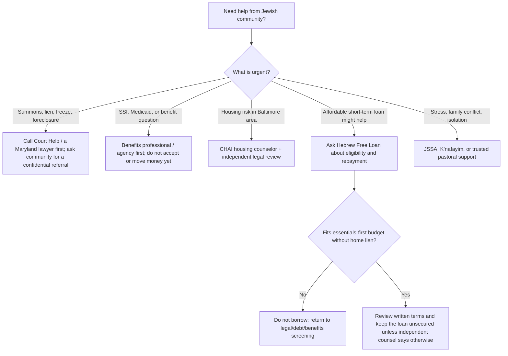

# Jewish community support and trusted referrals

For someone connected to Chabad or another Jewish community, it can be easier to begin with a trusted rabbi, rebbetzin, gabbai, or community-support contact. Ask for a **confidential referral**—not for an immediate loan, a personal guarantee, or a public appeal. The goal is to add practical support while preserving privacy, housing, benefits, and relationships.

> A Jewish community resource can be an important source of dignity, emotional support, or short-term help. It is not a replacement for a Maryland consumer/bankruptcy lawyer, an SSI/Medicaid benefits review, or independent advice before signing a loan or putting a lien on a home.

## Best first asks at Chabad or synagogue

Use a short, bounded request: “I am dealing with debt and disability-income questions. Could you make a confidential referral to someone who understands local resources, counseling, or interest-free loans? I am not asking you to lend or guarantee money.”

Ask whether the community knows a local **gemach** (mutual-aid fund), case manager, Jewish social-service agency, housing counselor, or attorney who can take the call. Do not assume a rabbi, congregation, or fund can provide debt advice, a loan, or confidentiality beyond its own policies; ask what information will be shared and with whom.

## Maryland-area starting points

| Resource | What it may help with | Important limit / first question |
|---|---|---|
| [Hebrew Free Loan Association of Baltimore](https://hebrewfreeloan.org/about/) | Interest-free loans for qualified members of the Greater Baltimore Jewish community, including sudden emergencies, medical/dental bills, home repairs, education, and other needs. | It expects a worthwhile purpose, inability to reasonably obtain a bank loan promptly, ability to repay, and may require references/co-signers. Ask whether a proposed debt payoff is eligible—and do not substitute it for a home-equity or benefits review. |
| [Hebrew Free Loan Association of Greater Washington](https://www.hebrewfreeloandc.org/) | Interest-free loans, advertised up to $30,000, for individuals and families facing financial challenges in the DC metro area. | Read current loan guidelines and repayment expectations before applying. A zero-interest loan still has to fit the essentials-first budget. |
| [JSSA J-Caring Community Support Line](https://www.jssa.org/services/hotline/) | Montgomery County: connections to debt legal assistance, debt/credit management, credit-report and collection issues, wage-garnishment help, financial assistance, mental-health support, and case navigation. | Coverage is listed for Montgomery County, Northern Virginia, and DC. Ask for the specific provider’s scope, cost, and confidentiality. Call 703-J-CARING (703-522-7464), Mon–Fri, 9 a.m.–5 p.m. ET. |
| [CHAI — Comprehensive Housing Assistance](https://chaibaltimore.org/what-we-do/housing-counseling/) | Free HUD-certified housing counseling for Baltimore City and County homeowners/renters, including foreclosure and eviction prevention. | CHAI says it does not provide direct financial assistance. Use it to understand housing choices; it does not replace independent legal advice on a new lien or bankruptcy. |
| [K’nafayim](https://www.knafayim.com/) | Free or low-cost counseling and education for local Jewish individuals, couples, and families; its site describes privacy-focused access. | It is emotional/family support, not debt, tax, benefits, or legal advice. Use it alongside—not instead of—the debt and benefits referrals above. |

## Choose the right kind of help

## Guardrails for an interest-free loan or community aid

- “Interest-free” does not mean risk-free. Confirm the total amount, payment schedule, co-signer consequences, default terms, and whether the proposed payment still leaves money for housing, food, medicine, utilities, insurance, and taxes.
- A loan can be preferable to a home-secured private loan because it does not automatically place the home at foreclosure risk. Do **not** turn community help into a deed, deed of trust, mortgage, HELOC, or title transfer without separate Maryland legal, title, tax, bankruptcy, and benefits advice.
- For SSI or concurrent SSI, a gift, loan, or cash kept into the next month can affect benefits. Get guidance before receiving funds. See [SSI](./terms/ssi/) and [disability income and benefits](./benefits/).
- A rabbi or counselor can help a person feel less alone and identify trusted local referrals. They should not be pressured to endorse a debt-settlement company, guarantee a loan, or decide a legal/financial issue outside their role.

## A private call checklist

Before calling, write only the minimum needed: county, whether there is a court deadline, SSDI/SSI/Medicaid status, basic housing situation, and the monthly amount left after essentials. Ask:

1. Is this confidential? Who will be told my name or details?
2. Is this a loan, a grant, counseling, referral, or emergency assistance?
3. What are the eligibility rules, fees, repayment terms, and co-signer expectations?
4. Can you refer me to a Maryland consumer/bankruptcy lawyer, benefits professional, HUD housing counselor, or nonprofit credit counselor?
5. Can I have the terms and referral details in writing?

Next: [Maryland help and referral list](./resources/) →
