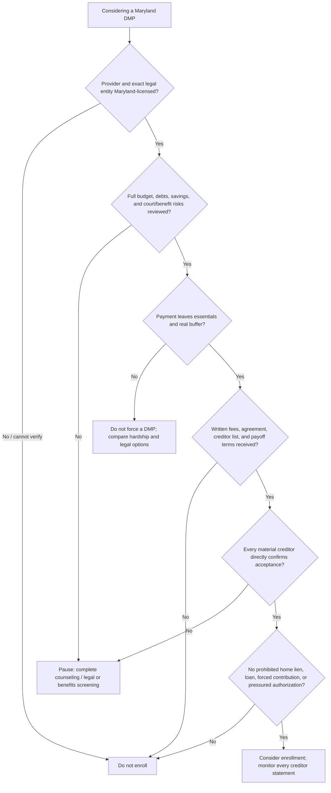

# Maryland DMP acceptance guide: what to share, protect, and require

**Reviewed August 21, 2026.** A nonprofit label is not enough. Before joining a debt-management plan (DMP), a Maryland resident needs an accurate budget review, a Maryland-licensed provider, written creditor-specific terms, and a payment that still works after essentials and a safety buffer. This guide is educational information, not legal or benefits advice.

> **The central rule:** be honest about all facts that determine whether a plan is safe; protect identity and payment-control information until you have independently verified the provider and understand the written authorization you are being asked to sign.

## What to share in a verified counseling session

Maryland requires a provider to prepare a financial analysis and initial budget using the consumer’s debt obligations, income, expenses, and savings, then determine that the DMP is suitable and payable. If the facts are incomplete, that suitability decision can be wrong. [Maryland Financial Institutions §12-916](https://mgaleg.maryland.gov/mgawebsite/Laws/StatuteText?article=gfi&section=12-916).

Share, using rounded figures for an initial screening and statements for the written plan:

| Share this | Why it matters |
|---|---|
| Reliable monthly income and source: SSI, SSDI, wages, pension, etc. | Tests whether the proposed payment is sustainable. The amount/source matters; a medical diagnosis generally does not. |
| Essential spending: housing, utilities, food, medicine, insurance, taxes, transportation, care, and a buffer | These are not “optional” money available for unsecured-card repayment. |
| Every debt: creditor, balance, APR, minimum, current/late/collection status, and joint borrower/guarantor | A DMP that omits a material account may not solve the problem. |
| Savings, foreseeable income/expense changes, and prior repayment arrangements | A plan needs to survive more than the first month. |
| Summons, judgment, garnishment/freeze, lien, foreclosure notice, bankruptcy consultation, or deadline | A DMP does not answer court papers or replace legal advice. Hiding this can produce an unsafe recommendation. |

Do not misstate or omit a creditor, court deadline, co-borrower, or essential cost in order to obtain a lower quoted payment. A lower quote based on missing facts is not a better plan.

## What to protect until the provider is verified and terms are written

FTC warns that unexpected debt-relief contacts seeking personal or financial information may be scams. Start contact yourself through the provider’s official site, not a caller-ID number, text link, ad, or social-media message. [FTC debt-relief warning](https://consumer.ftc.gov/consumer-alerts/2026/03/looking-debt-relief-heres-how-avoid-scam).

Do **not** provide or authorize merely to obtain a first quote:

- Full Social Security number; bank routing/account, debit, or credit-card numbers.
- Online-bank login, password, security-question answer, or one-time verification code.
- Remote access to a phone or computer.
- ACH/autopay, card payment, electronic signature, credit-report pull, creditor-contact authorization, or data-sharing consent.
- A photo of ID, full benefit award letter, or bank statement through ordinary email/text.
- Medical details beyond the financial facts necessary to test affordability, or privileged attorney communications.

Ask: “Why is this needed now? Is it optional? Will you pull my credit? Who receives it? How is it stored? Please send the privacy notice and authorization in writing.” This is not a reason to lie once a legitimate provider needs information to build an actual plan. It is a reason to use a secure channel and give informed consent.

## Maryland requirements before accepting a DMP

The following are practical acceptance conditions drawn from Maryland’s Debt Management Services Act and consumer guidance.

### 1. Verify licensing and identity

Work only with a provider licensed by Maryland’s Commissioner of Financial Regulation; verify the exact legal entity and NMLS record, not only the brand name. [Maryland OFR: Debt Management Services](https://labor.md.gov/finance/consumers/debtmgmtserv.shtml). A DMP agreement with an unlicensed provider is void under Maryland law, with paid fees recoverable under the statute. [§12-916](https://mgaleg.maryland.gov/mgawebsite/Laws/StatuteText?article=gfi&section=12-916).

### 2. Receive genuine counseling and alternatives

Before providing DMP services, the provider must give consumer education, a written summary of counseling options/strategies, an analysis and initial budget by a counselor certified through an independent organization, and a copy of the completed agreement. It must decide both that the DMP is suitable and that the consumer can meet the payment. [§12-916](https://mgaleg.maryland.gov/mgawebsite/Laws/StatuteText?article=gfi&section=12-916).

**Do not accept** if a representative says a DMP is the only option before reviewing the full budget, or if the payment leaves no cushion for essentials. CFPB explains that DMPs generally aim to lower payments/interest—not erase the principal balance—and may require years of timely payments. [CFPB: counseling versus settlement](https://www.consumerfinance.gov/ask-cfpb/what-is-the-difference-between-credit-counseling-and-debt-settlement-debt-consolidation-or-credit-repair-en-1449/).

### 3. Demand creditor-by-creditor written terms

The agreement should identify every included creditor and any creditor the provider reasonably expects will not participate. Before enrolling, obtain the proposed payment, first-payment date, APR/concession, account status, card-closure rule, and payoff month for each account. Then call each creditor directly to confirm the plan was accepted before sending payments to the provider, as CFPB recommends. [CFPB: choosing a credit counselor](https://www.consumerfinance.gov/ask-cfpb/what-is-credit-counseling-en-1451/).

### 4. Check all fees and the written agreement

Maryland consumer guidance states that a provider may charge a one-time consultation fee up to **$50**, plus up to **$8 per creditor per month**, with a maximum monthly fee of **$40**. [Maryland OFR guide](https://labor.md.gov/finance/consumers/debtmgmtserv.shtml).

Before signing, the agreement must state at least:

- The provider’s name, address, telephone number, and Maryland license number.
- Services and all consumer fees.
- The surety-bond/insurance disclosure.
- The financial institution holding funds before creditor disbursement.
- The payment schedule, amount, and due dates.
- Expected nonparticipating creditors.
- Credit-score impact, Maryland complaint notice, and the right to cancel at any time without penalty.

See Maryland’s [consumer guide](https://labor.md.gov/finance/consumers/debtmgmtserv.shtml) and the statutory agreement requirements in [§12-916](https://mgaleg.maryland.gov/mgawebsite/Laws/StatuteText?article=gfi&section=12-916).

### 5. Reject prohibited or dangerous terms

A Maryland DMP provider may not make the agreement depend on a “voluntary contribution,” take a mortgage or other security interest in the consumer’s property, buy the debt, lend money, provide credit, charge for credit insurance, or make deceptive statements. It also cannot propose reducing the debt owed to a creditor without the consumer’s written approval. [Maryland OFR guide](https://labor.md.gov/finance/consumers/debtmgmtserv.shtml).

Walk away if the provider promises to erase debt, tells you to ignore court papers, asks you to put unsecured debt on the home, refuses written fees/terms, or pressures you to authorize payment during the first call.

### 6. Resolve legal, benefits, and home risk separately

A DMP may be appropriate for eligible unsecured debt, but it is not legal representation. Obtain legal/benefits review before accepting a plan if a lawsuit, judgment, garnishment, bank freeze, foreclosure issue, SSI/Medicaid concern, or material home equity is involved. Start with [urgent help](./urgent-help/) and the [if-sued guide](./sued-and-debt-programs/).

## Acceptance decision tree

## Pre-signature checklist

| Must be “yes” before acceptance | Check |
|---|---|
| I verified the exact provider in Maryland/NMLS. | ☐ |
| A certified counselor reviewed my complete budget, debts, income, expenses, and savings. | ☐ |
| The payment leaves money for essentials and a safety buffer. | ☐ |
| I received a copy of the complete agreement and all fees in writing. | ☐ |
| I know every included/excluded creditor and the term for each account. | ☐ |
| I confirmed acceptance with every material creditor directly. | ☐ |
| I understand card closures, late-payment/cancellation rules, and how funds are held/disbursed. | ☐ |
| I can cancel without penalty and have the Maryland complaint information. | ☐ |
| A court, benefits, or home issue has been separately screened if relevant. | ☐ |
| I have not authorized payment, credit pull, or data sharing beyond what I read and chose. | ☐ |

After enrollment, compare the provider’s periodic statement with each creditor statement and escalate any difference promptly. Maryland OFR specifically advises comparing the provider’s quarterly statement against creditor statements. [Maryland OFR guide](https://labor.md.gov/finance/consumers/debtmgmtserv.shtml).

Next: [Maryland DMP first-call playbook](./first-call-dmp-playbook/) →

