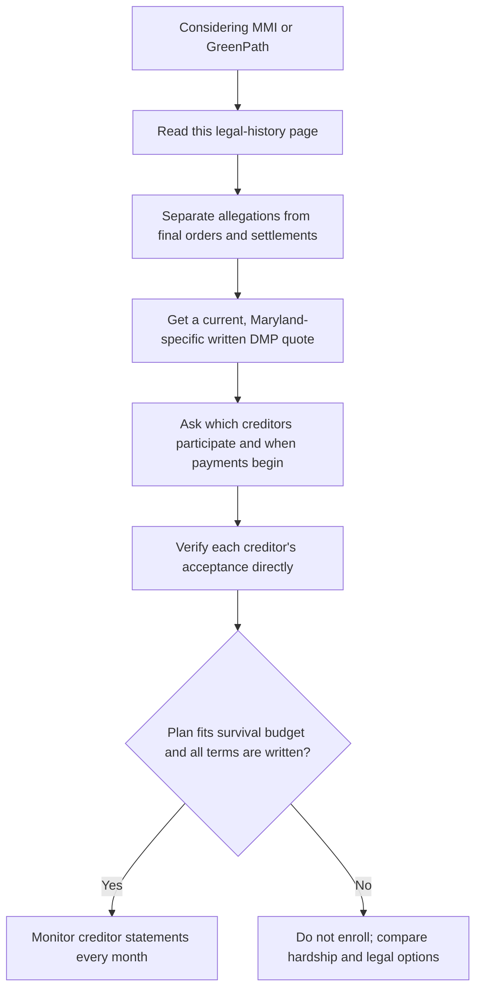

# Legal history of two DMP providers: MMI and GreenPath

**Reviewed August 17, 2026.** This page summarizes selected, publicly documented legal matters involving **Money Management International (MMI)** and **GreenPath, Inc./GreenPath Financial Wellness**. It is a due-diligence aid—not a complete litigation search, legal advice, or a finding that either organization is currently acting unlawfully.

> **Read outcomes precisely.** A complaint says what a plaintiff alleges. A denied motion to dismiss means the case may proceed; it is not a final liability finding. A settlement resolves claims, usually without deciding every allegation. A court judgment or regulator order is stronger evidence of the result in that particular matter. Entity names, services, governing law, and facts can also change over time.

## At a glance

| Provider | Matter | What was at issue | Verified public outcome | What it does—and does not—show |
|---|---|---|---|---|
| MMI | *Abat v. Money Management International* / *Money Management by Mail* (C.D. Cal., 2007) | Proposed consumer class claims concerning DMP fees, nonprofit/credit-repair representations, creditor relationships, and debt-collection disclosures. | A reported **$6.5 million class settlement** covered qualifying consumers who paid MMI DMP fees or contributions from December 28, 2002 through November 4, 2010. | Historical allegations and a settlement—not a judgment that every allegation was proved or that current practices are the same. |
| MMI | California Department of Corporations/DFPI matter, San Francisco case CGC-07-463953 | Whether MMI and related entities were operating as bill payers/proraters without a California license or exemption. | The regulator’s official record lists a formal settlement agreement, stipulated permanent injunction, and desist-and-refrain order. | A historic regulatory matter involving California law; read the order and settlement rather than treating a database label as a current licensing conclusion. |
| MMI | *Guishard v. Money Management International* (Texas, 2013–15) | One DMP client alleged breach of contract, including failure to make/credit creditor payments. | Summary judgment for MMI was affirmed on appeal after the claimant did not timely produce evidence responding to the motion. | A single case resolved for MMI; it does not establish that every DMP administration concern is unfounded. |
| GreenPath | *Pries v. GreenPath, Inc.* (M.D. Ga., 2020–21) | Proposed class claims that GreenPath’s DMP fee calculation exceeded Georgia’s 7.5% debt-adjustment cap. | The court denied GreenPath’s motion to dismiss and held, at that stage, that the cap is calculated from money distributed to creditors—not total money deposited including fees. | An important interpretation and procedural ruling, **not** a final damages judgment. A later final judgment or settlement was not verified in the reliable public records reviewed for this page. |

## Money Management International (MMI)

### 1. The *Abat* proposed class action and settlement

In the federal case styled *Janice Abat, Jeanne Rossean, and Nancy Wilksen v. Money Management International, Inc. and Money Management by Mail, Inc.*, consumers brought proposed class claims related to DMP services. The settlement notice described allegations that MMI operated like a for-profit organization, engaged in credit-repair activity without required compliance, collected debts owed to financial institutions, failed to disclose material creditor relationships, and acted as an undisclosed debt collector. Those are **allegations**, not findings that the court proved each one.

The public settlement materials reported that MMI made **$6.5 million** available to settle and compromise qualifying class members’ fee/contribution claims. The described class covered people nationwide who paid an initial or monthly fee and/or made contributions to MMI for DMP services from December 28, 2002 through November 4, 2010. [Settlement notice summary](https://classactionlawsuitsinthenews.com/class-action-settlements/mmi-money-management-international-money-management-by-mail-class-action-lawsuit-settlement/).

This case also involved separate, overlapping claims relating to Chase. Do not mix the amounts: a District of Columbia Attorney General CAFA notice describes a **separate $4.9 million Chase settlement** for a related class. It is not an additional $4.9 million paid by MMI. [D.C. OAG CAFA notice](https://oag.dc.gov/sites/default/files/2018-02/CAFA-Notice-June-2011.pdf).

**Meaning for a present-day DMP shopper:** Ask whether the organization receives creditor contributions, how that is disclosed, how staff are paid, what portion of each payment reaches each creditor, and how to complain or cancel. MMI currently says it may receive voluntary creditor contributions; compare its current disclosure with the written DMP agreement. [MMI disclosures](https://www.moneymanagement.org/disclosures).

### 2. California regulatory action

California’s Department of Financial Protection and Innovation (DFPI), the successor agency to the Department of Corporations, maintains an enforcement page for MMI and Money Management by Mail. It identifies San Francisco case CGC-07-463953 and links the complaint, preliminary injunction, stipulated permanent injunction, formal settlement agreement, and desist-and-refrain order. [DFPI enforcement record](https://dfpi.ca.gov/enforcement_action/money-management-international-inc/).

The formal settlement agreement states that the California bill-payer/prorater law required licensing or exempt status and that the defendants had not been licensed, while they contended they were exempt. The point is not to decide that old dispute from a summary: use it as a signal to ask for the **current, state-specific** authorization and written fee terms. [Formal settlement agreement](https://dfpi.ca.gov/wp-content/uploads/sites/337/2013/03/MoneyManagement_FormalSA.pdf).

### 3. Individual DMP breach-of-contract suit

In *Guishard v. Money Management International, Inc./Consumer Credit Counseling Service*, a Texas customer alleged that MMI failed to make payments to creditors and credit her account. The trial court granted MMI summary judgment; the Texas Fourteenth Court of Appeals affirmed in 2015. The appellate court explained that the customer did not timely answer discovery or the summary-judgment motion with evidence. [Texas appellate opinion](https://law.justia.com/cases/texas/fourteenth-court-of-appeals/2015/14-14-00362-cv.html).

This result is not a broad audit of MMI’s payment system. It does underline a practical rule: a DMP client should check creditor statements every month, keep confirmations, and escalate a missing/late credit promptly rather than assuming a payment was posted.

## GreenPath Financial Wellness

### *Pries v. GreenPath, Inc.* — Georgia DMP fee calculation

Two GreenPath DMP clients filed a proposed class action under the Georgia Debt Adjustment Act and Georgia Fair Business Practices Act. They alleged that GreenPath retained fees above Georgia’s 7.5% ceiling because it calculated the percentage using the amount the client deposited, including the fee, instead of the money actually distributed to creditors.

The federal court denied GreenPath’s motion to dismiss on January 5, 2021. It held that, for the statute at issue, the 7.5% cap is based on the amount paid **for distribution to creditors**. The court also held that the plaintiffs had sufficiently pleaded the statutory claims; it did not award damages or enter a final merits judgment at that stage. [*Pries* order, 528 F. Supp. 3d 1353](https://law.justia.com/cases/federal/district-courts/georgia/gamdce/5%3A2020cv00353/117400/19/).

GreenPath argued that one plaintiff had accepted a refund. The court said that did not eliminate standing at the motion-to-dismiss stage, because GreenPath did not dispute that it had retained more than 7.5% of what it distributed to creditors under the court’s interpretation. This describes the court’s procedural ruling—not a conclusion about every GreenPath customer or every state’s fee law.

**Outcome limit:** The reliable, freely accessible docket material I reviewed stops around the January 2021 dismissal ruling. I could not independently verify a later final judgment, dismissal, or settlement. Therefore this wiki does **not** call the case a final GreenPath loss, does not report damages, and does not infer that a similar rule automatically applies in Maryland.

## How to use this history without overreacting

### Questions to ask either provider now

- What is the legal entity enrolling me and what current state authorization applies to my Maryland account?
- Give the full fee schedule: setup, monthly, cancellation, returned-payment, and any other charge. Which fees can be waived?
- Is any part of my payment retained before creditors are paid? Show a month-one allocation by creditor and by fee.
- Do you receive voluntary contributions or any other funding from creditors? How does that affect staff incentives or creditor participation?
- Which of my specific creditors have accepted the proposed plan? When will each begin receiving payments and concessions?
- What happens if a payment is late, short, rejected, or a creditor fails to post it? Who fixes it, on what timeline, and how do I escalate?
- If I have a summons, judgment, or collection attorney, do you provide legal representation? (A DMP provider ordinarily does not replace court counsel.)

Use this alongside the [nonprofit DMP comparison](./compare-credit-counselors/) and the [if-sued decision guide](./sued-and-debt-programs/). For current selection, the written plan, direct creditor verification, affordability, and court/benefits risks matter more than an old lawsuit title alone.

