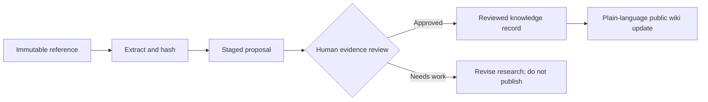

# Research and review trail

This public site is the plain-language presentation layer. Its evidence and future updates are tracked in the companion [llm_wiki research workspace](https://github.com/arman-stack/llm_wiki), which keeps original reference snapshots, source hashes, staged proposals, review status, and lint reports.

## What has been incorporated

The current decision packet is stored as an immutable source snapshot in the research workspace: [Maryland Debt Options Packet — August 16, 2026](https://github.com/arman-stack/llm_wiki/blob/main/wiki/sources/maryland-debt-options-packet-2026-08-16-1de20be1.md). It provides the factual foundation for this site’s worksheets, decision trees, resource list, benefit guidance, scam warnings, FAQs, and key-term pages.

The snapshot is a research record, not a substitute for the official laws, agency guidance, court materials, and local professional advice linked throughout this site. Because debt, benefits, and court matters are fact-specific, a source entering the workspace is not automatically treated as a reviewed public claim.

## How an update becomes public guidance

The workflow keeps a useful boundary: presentation pages should be calm and readable, while the evidence trail remains auditable. When rules, resource availability, or fees change, the source should be updated through the research workspace and independently checked before this public site is changed.

For the operating details, including the required proposal/review/lint sequence, see the [llm_wiki README](https://github.com/arman-stack/llm_wiki#review-first-proposal-workflow).
