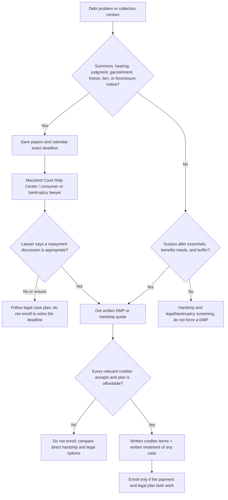

# If you are sued: debt programs, court steps, and questions

**Reviewed August 17, 2026.** A credit-counseling plan can be worth comparing, but it does **not** answer a lawsuit, appear in court for you, or erase a judgment. Preserve the deadline and get Maryland legal help first. This guide is education, not legal advice.

> **The rule that avoids the biggest mistake:** do not wait to see whether a counselor, creditor, or settlement company will make the case go away. Follow the date and instructions on the actual summons. In Maryland District Court, the complaint identifies who is suing, why, and how much is claimed; the court's [sued-in-District-Court guide](https://www.courts.state.md.us/courthelp/suedindistrictcourt) explains possible responses and defenses. Free civil help is available from the [Maryland Court Help Center](https://www.courts.state.md.us/helpcenter) at 410-260-1392.

## Do these today

1. **Photograph and save every page, envelope, and case number.** Calendar the court date and any response deadline exactly as written. Do not rely on this page, a collector, or a program representative to calculate it.
2. **Contact legal help promptly.** Ask the Maryland Court Help Center, Maryland legal aid, or a consumer/bankruptcy attorney what the papers require and whether there are defenses. For assigned consumer debt, Maryland's court form explains that the plaintiff has documentation obligations; bring the complaint and attachments. [Maryland Courts: assigned consumer-debt information](https://www.courts.state.md.us/sites/default/files/court-forms/dccv001dbr_10.2023wm.pdf).
3. **Keep benefit and bank records.** If SSI or SSDI is directly deposited, retain award letters and statements tracing those deposits. See [SSI, SSDI, and Medicaid](./benefits/).
4. **Get no more than two written DMP screens while legal help is underway.** Do not pay or enroll merely because a representative says a creditor “usually” pauses a case.

## What the public provider materials actually say

I used browser checks on the relevant public pages of the four providers in the [nonprofit DMP comparison](./compare-credit-counselors/) on August 17, 2026. These are provider statements, not independent proof that a creditor will dismiss a particular case. I did **not** find an audited, provider-by-provider public rate showing how often enrolled clients had lawsuits dismissed, settled, or reduced. That absence is important: testimonials, star ratings, and a provider's general process are not case-outcome evidence.

| Provider | What its published process says | What that means if a case already exists | Ask before enrolling |
|---|---|---|---|
| [MMI](https://www.moneymanagement.org/debt-management) | A standard DMP routes one payment through the agency. MMI separately markets a **Debt Resolution Plan**, where funds may be held while it seeks settlements; MMI says creditors may sue in that model and describes optional legal support. Its lawsuit article describes complaint/summons, response, default judgment, settlement, and trial. | Do not confuse a DMP with MMI's debt-resolution product. Neither label tells you that a particular court case has stopped. | “Is this a DMP or Debt Resolution Plan? Which creditor receives a payment in month one? Has the plaintiff agreed in writing to dismiss, stay, or settle this case? Who, exactly, handles legal notices?” |
| [GreenPath](https://www.greenpath.com/counseling/debt-management/) | GreenPath says you deposit one monthly payment and it pays creditors; it says collection calls stop **once creditors agree** to the plan. It says it works with most creditors, not every creditor. | Acceptance is a creditor-by-creditor event, so the phrase “once creditors agree” is not a promise about a pending suit. Obtain the named creditor's answer in writing. | “Is the plaintiff/collector included? What is its written acceptance date? Until that date, what should I do with the court case? Do you provide legal representation?” |
| [InCharge](https://www.incharge.org/debt-relief/sued-credit-card-debt/) | InCharge says an original card issuer *may* agree to drop a lawsuit after DMP enrollment, while also saying counseling does not replace legal advice and a person already sued should speak to a lawyer, legal aid, or court help. | This is the clearest provider-specific possibility found, but it is conditional—not a guarantee—and it depends on the creditor and a written court resolution. | “Is this debt still owned by the original creditor? Will it sign a dismissal or settlement with a case number? What must I file or appear for before that happens?” |
| [Apprisen](https://www.apprisen.com/dmp-welcome-kit/) | Apprisen's DMP welcome material says creditors may contact a new client during the first three months and directs clients to forward legal correspondence. It also says a late, incomplete, or missed program payment can allow a creditor to resume collections and legal action. | Forwarding papers is useful administration; it does not transfer the court deadline to Apprisen. Ask how the plan treats the specific plaintiff. | “Which legal papers should I send you, and how? Who confirms receipt? Does the creditor agree in writing to resolve this case? What happens after one late payment?” |

Provider pages: [MMI on a creditor suit](https://www.moneymanagement.org/blog/what-happens-when-sued-by-a-creditor), [MMI on debt-resolution risk](https://www.moneymanagement.org/debt-resolution/pros-and-cons-of-debt-resolution), [GreenPath DMP](https://www.greenpath.com/counseling/debt-management/), [InCharge on a credit-card suit](https://www.incharge.org/debt-relief/sued-credit-card-debt/), and [Apprisen DMP welcome kit](https://www.apprisen.com/dmp-welcome-kit/).

## How the paths differ

| Path | Basic process | Lawsuit / home / benefit caution |
|---|---|---|
| **Direct hardship or a DMP** | You or a counselor proposes an affordable repayment plan. A DMP commonly collects one payment and sends it to participating unsecured creditors; accounts may close and concessions vary. | A pending case still needs an independent response. Ask the plaintiff for a written agreement tied to the case number; do not assume enrollment changes the court calendar. |
| **Debt settlement / resolution** | Payments may stop while money accumulates for an offer less than the full balance. | CFPB warns this can increase fees, interest, collection activity, credit damage, and lawsuit risk. It is especially poor to enter without legal review when a suit, home equity, benefits, or no workable budget is involved. [CFPB: debt-relief risks](https://www.consumerfinance.gov/ask-cfpb/what-is-a-debt-relief-program-and-how-do-i-know-if-i-should-use-one-en-1457/). |
| **Consolidation loan** | A new loan pays existing debts; the borrower owes the new lender. | Do not use a loan secured by a home to make unsecured card debt “fit.” It can add foreclosure risk. Check total cost, not just payment. |
| **Legal / bankruptcy consultation** | A lawyer or legal-aid resource evaluates the actual complaint, defenses, assets, income, judgments, and bankruptcy options. | This is the first branch when the case exists, a judgment/garnishment/freeze/lien is involved, or SSI/SSDI, Medicaid, or material home equity changes the stakes. Only a qualified lawyer can give case-specific advice. |

## Questions they must answer — write the answer down

### Questions for every counselor or program

- What exact product am I being offered: counseling only, DMP, settlement/debt resolution, or a new loan?
- List every creditor and account included. Which are excluded, already charged off, assigned, or in litigation?
- What is the new payment, enrollment fee, monthly fee, total program cost, and estimated final payment date? Is there a hardship waiver?
- What will each creditor receive in the first month and when does each concession begin?
- Which cards close? What happens after one late, short, or missed payment?
- Does any employee compensation depend on my enrollment or payment? Does the organization receive creditor contributions? MMI discloses that it may receive voluntary creditor contributions; ask any organization to disclose relevant compensation. [MMI disclosures](https://www.moneymanagement.org/disclosures).
- Send all promises, creditor participation, fees, cancellation rules, and complaint process in writing. CFPB advises confirming that creditors accepted a proposed DMP **before** sending money to the counseling organization. [CFPB: choosing credit counseling](https://www.consumerfinance.gov/ask-cfpb/what-is-credit-counseling-en-1451/).

### Add these if a lawsuit, judgment, or collection attorney is involved

- What is the court, case number, plaintiff, next deadline, and hearing date? Put them in writing.
- Is the plaintiff the original creditor, a buyer, or a collector? Who has authority to settle or dismiss?
- Does the plaintiff agree **in writing** to a dismissal, stay, settlement, or payment arrangement? What filing or appearance is still required until that is entered?
- Will the proposed agreement release the whole claim and state the exact balance, due dates, reporting, default terms, and effect on the judgment? Have a lawyer review it.
- Does the program represent me in court? If not, who is responsible for the response and hearing? The safe default is **you and your lawyer**, not the DMP provider.
- Could SSI/SSDI deposits, a bank account, a home, a lien, or Medicaid eligibility be affected? What documents should legal counsel review?

## One-page decision worksheet

| Write this down before choosing | Answer / proof saved |
|---|---|
| Court, case number, plaintiff, and next date |  |
| Court Help Center / lawyer contact and appointment |  |
| Original creditor or debt buyer/collector? |  |
| Essentials-first monthly surplus (after food, housing, medicine, utilities, insurance, taxes, transport, and buffer) | $ |
| Direct hardship offer from each creditor |  |
| DMP offer: payment / fees / payoff date |  |
| Is every litigating creditor included and accepted in writing? |  |
| Written court disposition (dismissal, settlement, stay, or none) |  |
| Card closures and missed-payment rule |  |
| SSI/SSDI, Medicaid, bank, home, lien, or foreclosure issue reviewed? |  |
| Reason this path still works after one bad month |  |

**Stop and get legal help again** if anyone says “enroll today and we will handle the lawsuit,” asks you to ignore papers, will not identify the product, will not give written fees/creditor terms, asks you to put debt on your home, or promises a result. See [urgent court, freeze, and foreclosure help](./urgent-help/), [scam warnings](./scams/), and the [nonprofit DMP comparison](./compare-credit-counselors/).

