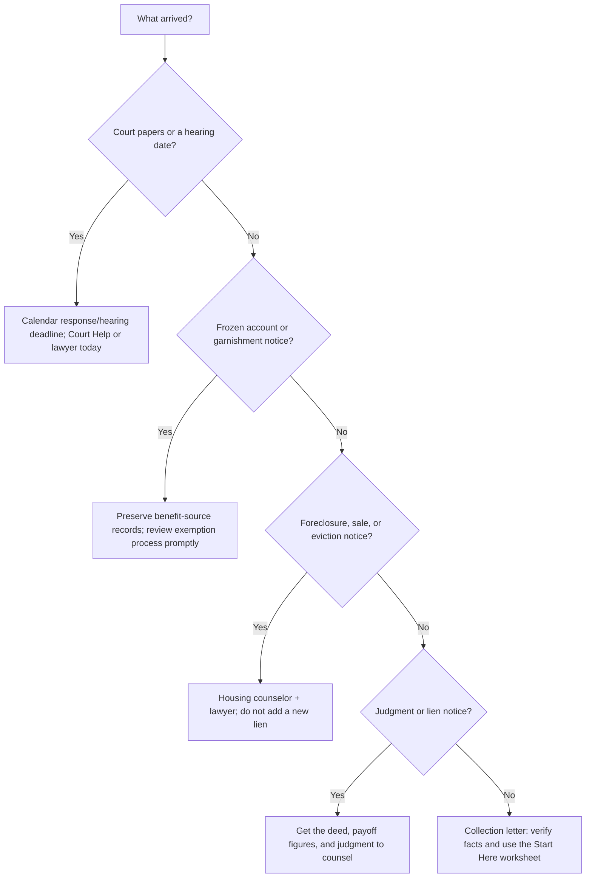

# Urgent: court papers, frozen account, lien, or foreclosure

**Do not wait for a perfect plan.** If a summons, garnishment/frozen-account notice, judgment/lien notice, foreclosure notice, sheriff notice, or sale deadline arrived, protect the deadline and get help today.

## Do these first

1. **Read every page and calendar the exact deadline.** A collection letter, a lawsuit, a judgment, and a foreclosure notice are different. Do not assume a call to a collector extends a court deadline.
2. **Keep the papers and make copies.** Save envelopes, case numbers, account statements, benefit award letters, and every notice. Do not alter records.
3. **Do not transfer money or property.** Do not add someone to the deed, sign a new lien, take a HELOC, repay a friend/family member, or make a large gift to “protect” assets before legal and benefits advice.
4. **Call the right starting point.** Use [Maryland Court Help](https://www.courts.state.md.us/helpcenter), a Maryland consumer/bankruptcy lawyer, or the [Maryland resources list](./resources/). If the issue is foreclosure or eviction in Baltimore City/County, [CHAI](https://chaibaltimore.org/what-we-do/housing-counseling/) offers free HUD-certified housing counseling.
5. **Protect benefit evidence.** If Social Security is directly deposited, preserve statements showing the deposits and the award letter. A bank-account exemption process may still be required. See [SSI, SSDI, and Medicaid](./benefits/).

If the notice is a consumer-debt lawsuit, use the [lawsuit, debt-program, and legal-decision guide](./sued-and-debt-programs/) to compare a DMP or hardship offer without missing the court process.

## Choose the branch that matches the notice

## What not to let urgency do to you

- Do not hire a debt-settlement company because it promises to “stop” a lawsuit. Read [scam and settlement warnings](./scams/).
- Do not sacrifice food, medicine, utilities, insurance, taxes, or housing for an unsecured-card payment just because a collector demands it.
- Do not sign a friend’s note, deed of trust, or mortgage because the relationship feels urgent. A new home lien can turn card debt into foreclosure-capable debt.
- Do not rely on this page as legal advice. Bring the actual papers to a qualified Maryland professional.

Next: [start with facts and a survival budget](./getting-started/) →
